# 🌐 Prem Prakash Portfolio

Welcome to my developer portfolio!  
This project is built using **HTML**, **CSS**, and **JavaScript** to showcase my skills and projects in various domains like AI/ML, Web Development, Mobile Apps, UI/UX, and more.

---

## 📁 Directory Structure

```
xyzcode94-portfolio/
├── README.md
├── index.html
├── sitemap.xml
├── robots.txt
├── googleb44328186f7c82f4.html
└── assests/
    ├── css/
    │   ├── ai&ml.css
    │   ├── database.css
    │   ├── mobile-dev.css
    │   ├── style.css
    │   ├── thankyou.css
    │   ├── web-dev.css
    │   └── workpage.css
    ├── pages/
    │   ├── ai-ml.html
    │   ├── database-management.html
    │   ├── mobile-development.html
    │   ├── thankyou.html
    │   ├── ui-ux-design.html
    │   ├── video-editing.html
    │   ├── web-development.html
    │   └── workpage.html
    ├── script/
    │   ├── ai-ml.js
    │   ├── script.js
    │   └── web-dev.js
    └── image/
```

---

## 📊 Portfolio Structure

```mermaid
graph TB
    U["User Browser"]
    H["Static Hosting / CDN"]

    U --> H

    H --> index["index.html"]
    H --> pages["assets/pages/"]
    pages --> ai["ai-ml.html"]
    pages --> db["database-management.html"]
    pages --> mobile["mobile-development.html"]
    pages --> ui["ui-ux-design.html"]
    pages --> video["video-editing.html"]
    pages --> web["web-development.html"]
    pages --> work["workpage.html"]
    pages --> thank["thankyou.html"]

    H --> css["assets/css/"]
    css --> aiCss["ai&ml.css"]
    css --> dbCss["database.css"]
    css --> mobCss["mobile-dev.css"]
    css --> styleCss["style.css"]
    css --> thankCss["thankyou.css"]
    css --> webCss["web-dev.css"]
    css --> workCss["workpage.css"]

    H --> js["assets/script/"]
    js --> aiJs["ai-ml.js"]
    js --> webJs["web-dev.js"]
    js --> mainJs["script.js"]

    H --> img["assets/image/"]
    H --> docs["assets/docs/"]
    docs --> cv["CV.pdf"]

    H --> cfg["Configuration"]
    cfg --> robots["robots.txt"]
    cfg --> sitemap["sitemap.xml"]
    cfg --> google["googleb44328186f7c82f4.html"]
```



---


---

## 🔗 Live Demo

You can view the live deployed version here:  
👉 [https://xyzcode94.github.io/portfolio/](https://xyzcode94.github.io/portfolio/)

---

## 📬 Contact

Want to collaborate or hire me?  
📧 Email: newmail9472@gmail.com

🔗 LinkedIn: [linkedin.com/in/my-profile](https://linkedin.com/in/prem-prakash-2bb94b358)

---

> 💡 This portfolio is actively updated. Future additions include dark mode, animations, project filtering, and interactive charts.
