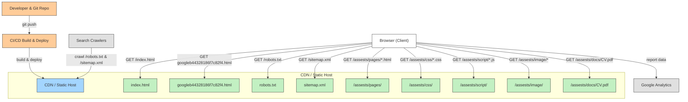

# Portfolio
About my  journey of life | Achievement of my life

```mermaid
flowchart TD
    %% Developer and CI/CD
    DevRepo["Developer & Git Repo"]:::dev
    CI["CI/CD Build & Deploy"]:::ci

    DevRepo -->|"git push"| CI
    CI -->|"build & deploy"| CDNHost

    %% CDN / Static Host
    subgraph "CDN / Static Host"
        direction TB
        CDNHost["CDN / Static Host"]:::cdn

        RootIndex["index.html"]:::asset
        RootGoogle["googleb44328186f7c82f4.html"]:::asset
        RootRobots["robots.txt"]:::asset
        RootSitemap["sitemap.xml"]:::asset

        Pages["/assests/pages/"]:::asset
        CSSDir["/assests/css/"]:::asset
        JSDir["/assests/script/"]:::asset
        ImgDir["/assests/image/"]:::asset
        Docs["/assests/docs/CV.pdf"]:::asset
    end

    %% Browser and External Services
    Browser["Browser (Client)"]:::client
    ExtAnalytics["Google Analytics"]:::external
    ExtSearch["Search Crawlers"]:::external

    %% Data Flows
    Browser -->|"GET /index.html"| RootIndex
    Browser -->|"GET googleb44328186f7c82f4.html"| RootGoogle
    Browser -->|"GET /robots.txt"| RootRobots
    Browser -->|"GET /sitemap.xml"| RootSitemap

    Browser -->|"GET /assests/pages/*.html"| Pages
    Browser -->|"GET /assests/css/*.css"| CSSDir
    Browser -->|"GET /assests/script/*.js"| JSDir
    Browser -->|"GET /assests/image/*"| ImgDir
    Browser -->|"GET /assests/docs/CV.pdf"| Docs

    Browser -->|"report data"| ExtAnalytics
    ExtSearch -->|"crawl /robots.txt & /sitemap.xml"| CDNHost

    %% Click Events
    click DevRepo "https://github.com/xyzcode94/portfolio/blob/main/README.md"
    click RootIndex "https://github.com/xyzcode94/portfolio/blob/main/index.html"
    click RootGoogle "https://github.com/xyzcode94/portfolio/blob/main/googleb44328186f7c82f4.html"
    click RootRobots "https://github.com/xyzcode94/portfolio/blob/main/robots.txt"
    click RootSitemap "https://github.com/xyzcode94/portfolio/blob/main/sitemap.xml"
    click Pages "https://github.com/xyzcode94/portfolio/tree/main/assests/pages/"
    click CSSDir "https://github.com/xyzcode94/portfolio/tree/main/assests/css/"
    click JSDir "https://github.com/xyzcode94/portfolio/tree/main/assests/script/"
    click ImgDir "https://github.com/xyzcode94/portfolio/tree/main/assests/image/"
    click Docs "https://github.com/xyzcode94/portfolio/blob/main/assests/docs/CV.pdf"

    %% Styles
    classDef dev fill:#ffcc99,stroke:#333,stroke-width:1px
    classDef ci fill:#ffcc99,stroke:#333,stroke-width:1px
    classDef cdn fill:#a3d5ff,stroke:#333,stroke-width:1px
    classDef asset fill:#c2f0c2,stroke:#333,stroke-width:1px
    classDef client fill:#ffffff,stroke:#333,stroke-width:1px
    classDef external fill:#e0e0e0,stroke:#333,stroke-width:1px
```
