# 🌐 Prem Prakash Portfolio

This repository contains the code for my personal developer portfolio. It is built using HTML, CSS, and JavaScript and showcases projects across domains like AI/ML, Web Development, Mobile Apps, UI/UX, and more.

---

## 📁 Directory Structure

```
xyzcode94-portfolio/
├── README.md
├── googleb44328186f7c82f4.html
├── index.html
├── robots.txt
├── sitemap.xml
└── assests/
    ├── css/
    │   ├── ai&ml.css
    │   ├── database.css
    │   ├── mobile-dev.css
    │   ├── style.css
    │   ├── thankyou.css
    │   ├── web-dev.css
    │   └── workpage.css
    ├── pages/
    │   ├── ai-ml.html
    │   ├── database-management.html
    │   ├── mobile-development.html
    │   ├── thankyou.html
    │   ├── ui-ux-design.html
    │   ├── video-editing.html
    │   ├── web-development.html
    │   └── workpage.html
    └── script/
        ├── ai-ml.js
        ├── script.js
        └── web-dev.js
```

---

## 📊 Visual File Map (Vertical View)

```mermaid
flowchart TB
    %% Main Layers
    U["User Browser"]:::user
    H["Static Hosting / CDN"]:::hosting

    U -->|requests static assets| H

    %% HTML Files
    subgraph "HTML Files"
        direction TB
        index["index.html"]:::frontend
        pagesDir["pages/"]:::frontend
        index -->|"links to"| pagesDir
        pagesDir --> ai["ai-ml.html"]:::frontend
        pagesDir --> db["database-management.html"]:::frontend
        pagesDir --> mobile["mobile-development.html"]:::frontend
        pagesDir --> ui["ui-ux-design.html"]:::frontend
        pagesDir --> video["video-editing.html"]:::frontend
        pagesDir --> web["web-development.html"]:::frontend
        pagesDir --> work["workpage.html"]:::frontend
        pagesDir --> thank["thankyou.html"]:::frontend
    end

    %% CSS Files
    subgraph "Stylesheets (assets/css)"
        direction TB
        cssDir["assets/css/"]:::css
        cssDir --> aiCss["ai&ml.css"]:::css
        cssDir --> dbCss["database.css"]:::css
        cssDir --> mobCss["mobile-dev.css"]:::css
        cssDir --> styleCss["style.css"]:::css
        cssDir --> thankCss["thankyou.css"]:::css
        cssDir --> webCss["web-dev.css"]:::css
        cssDir --> workCss["workpage.css"]:::css
    end

    %% JS Files
    subgraph "Scripts (assets/script)"
        direction TB
        jsDir["assets/script/"]:::script
        jsDir --> aiJs["ai-ml.js"]:::script
        jsDir --> webJs["web-dev.js"]:::script
        jsDir --> mainJs["script.js"]:::script
    end

    %% Images
    subgraph "Images (assets/image)"
        direction TB
        imgDir["assets/image/"]:::image
    end

    %% Documents
    subgraph "Documents (assets/docs)"
        direction TB
        docsDir["assets/docs/"]:::docs
        docsDir --> cv["CV.pdf"]:::docs
    end

    %% Configuration Files
    subgraph "Configuration"
        direction TB
        robots["robots.txt"]:::config
        sitemap["sitemap.xml"]:::config
        google["googleb44328186f7c82f4.html"]:::config
    end

    %% Connections from Hosting
    H --> index
    H --> pagesDir
    H --> cssDir
    H --> jsDir
    H --> imgDir
    H --> docsDir
    H --> robots
    H --> sitemap
    H --> google

    %% Styles
    classDef user fill:#FFFACD,stroke:#333,stroke-width:1px
    classDef hosting fill:#FFA500,stroke:#333,stroke-width:1px
    classDef frontend fill:#ADD8E6,stroke:#333,stroke-width:1px
    classDef css fill:#90EE90,stroke:#333,stroke-width:1px
    classDef script fill:#98FB98,stroke:#333,stroke-width:1px
    classDef image fill:#FFEFD5,stroke:#333,stroke-width:1px
    classDef docs fill:#D3D3D3,stroke:#333,stroke-width:1px
    classDef config fill:#F5DEB3,stroke:#333,stroke-width:1px
```




---

## 🔗 Live Demo

You can visit the live version of this portfolio here:  
👉 [https://xyzcode94.github.io/portfolio/](https://xyzcode94.github.io/portfolio/)

---

Would you like me to:

- Export this whole `README.md` as a downloadable file?
- Add GitHub Actions or Netlify build status badges?
- Auto-generate file stats (like last updated dates)?

Let me know!
